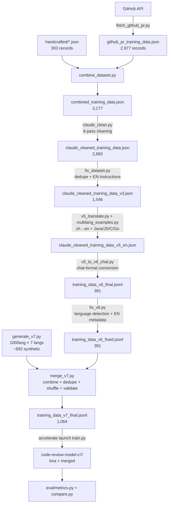

# Method

End-to-end methodology used to build the Qwen2.5-Coder-7B security code-review
model, from raw data collection through training and evaluation.

---

## 1. Data Collection

### 1.1 GitHub PR mining
- Script: `data/fetch_github_pr.py`
- GitHub REST API via `GITHUB_TOKEN` from `.env`
- 20 curated repositories focused on Python backends / security-relevant projects
- Extract: inline review comments (`github_inline_comment`) + review bodies (`github_review_body`)
- Output: 2,977 records in `github_pr_training_data.json`
- Rate limiting: native pagination + GitHub's 5k/hr authenticated limit

### 1.2 Hand-crafted examples
- `training_data/code_review_training_data.json` — 200 single-issue examples
- `training_data/multi_issue_training_data.json` — 103 multi-issue examples
- Each: structured JSON review with issue type, severity, description, suggestion, and fixed_code
- Purpose: provide structured labels (severity, fixed_code) that PR review comments lack

### 1.3 Synthetic generation (v7 addition)
- Script: `data/generate_v7.py`
- Model: `claude-haiku-4-5-20251001` via Anthropic SDK
- 100 examples per language × 7 languages (python/js/java/c/go/php/rust) = 700 target
- Mix: 80% vulnerable (40% High / 45% Medium / 15% Low), 20% clean code
- Controlled vulnerability taxonomy covering 15 CWE-like categories
- Few-shot prompting: 3 existing handcrafted examples sampled per target language
  (fallback to python if the language pool has < 3)

---

## 2. Data Processing

### 2.1 Combination
- Script: `data/combine_dataset.py`
- Merges GitHub PRs + handcrafted into `combined_training_data.json` (3,177 records)

### 2.2 Deep cleaning (9-pass pipeline)
- Script: `data/claude_clean.py`
- Removes malformed outputs, near-duplicate comments, non-code reviews,
  missing-context comments, and overly terse replies
- Output: `claude_cleaned_training_data.json` (2,683 records)

### 2.3 Post-processing
- Script: `data/fix_dataset.py`
- Deduplication on `input` field (code snippet)
- Injects English instruction headers for bilingual coverage
- Output: `claude_cleaned_training_data_v3.json` (1,546 records)

### 2.4 Translation (v5 pipeline)
- Scripts: `data/extract_strings.py`, `data/v5_translate.py`, `data/apply_translations_v5.py`
- Extract Chinese strings from cleaned v3 data (`zh_descriptions.txt`, `zh_suggestions.txt`, etc.)
- Translate via Claude API with a structured system prompt that preserves JSON structure
  and never touches `fixed_code` or numeric fields
- Manual translation dicts for curated review (`translations_part*.py`)
- Output: `claude_cleaned_training_data_v5_en.json`

### 2.5 Multilingual expansion
- Script: `data/multilang_examples.py`
- Adds handcrafted examples in Java, JavaScript, C/C++, Go
- Balances the single-language (python) distribution

### 2.6 Format conversion (v5 → v6)
- Script: `data/v5_to_v6_chat.py`
- Converts `{instruction, input, output}` → `{messages: [system, user, assistant]}`
- System prompt standardized to English; user message includes `"Review this code..."` framing
- Output: `training_data_v6_final.jsonl` (391 records after filtering)

### 2.7 Metadata enrichment (v6 → v7)
- Script: `data/fix_v6.py`
- **Language detection** via source-code heuristics:
  - `<?php` → php
  - `fn ... + let mut` → rust
  - `func ... + package ...` → go
  - `public class` / `public static void` → java
  - `#include` / `int main(` → c or cpp (cpp if `std::` / `<iostream>` / `using namespace`)
  - `function` / `const` / `let` / `var` / `=>` → javascript
  - `def` / `import` / `print(` → python (default)
  - 363 of 391 entries were `unknown` before detection
- **Problem type translation** via a curated Chinese → English mapping:
  - Split compound labels on ` + ` and translate each segment
  - Unknown segments preserved and printed for manual review

### 2.8 Merge + dedupe (v7 final)
- Script: `data/merge_v7.py`
- Combine fixed v6 (391) + synthetic (~692) = 1,083
- Deduplicate on user message content (exact match) → 1,064
- Shuffle with fixed seed (42) for reproducibility
- Final output: `training_data_v7_final.jsonl`

---

## 3. Quality Assurance

### 3.1 Validation
- `data/checking_dataset.py` — distribution inspector (length, source, severity, language)
- Every generated entry validated before saving:
  - Output must parse as JSON
  - Must contain `issues` (list) and `overall_score` (1-10)
  - Must have non-empty `user_message` and `assistant_output`
- Token length check against `MAX_SEQ_LEN=2048` (max observed: 995 tokens — zero truncation)

### 3.2 Resume-safe progress tracking
- Every long-running script (translator, generator) writes progress atomically every N entries:
  - `open(tmp, "w") → json.dump → os.replace(tmp, final)`
  - Restart reads the progress file and skips completed indices
- Progress files: `translation_progress.json`, `generation_progress.json`

### 3.3 Retry + backoff
- API failures retried 3× with exponential backoff (1s, 2s, 4s)
- Separate retry loop for *validation* failures (invalid JSON from model) — same 3-retry limit
- After exhausting retries, entry logged as failed and skipped

### 3.4 Concurrency
- Synthetic generation uses `asyncio.Semaphore(5)` with `AsyncAnthropic`
- 5 concurrent API calls keeps throughput high without hitting rate limits
- Progress file updated synchronously to avoid corruption

---

## 4. Training

### 4.1 Base model & quantization
- Base: `Qwen/Qwen2.5-Coder-7B-Instruct`
- 4-bit NF4 quantization via Unsloth (QLoRA)
- `bnb_4bit_compute_dtype=torch.bfloat16` for Ampere+ GPUs

### 4.2 LoRA configuration
- Rank: 16, alpha: 32, dropout: 0.05
- Target modules: `q_proj, k_proj, v_proj, o_proj, gate_proj, up_proj, down_proj`
- Trainable params: 40.4M / 7.6B (0.53%)

### 4.3 Training hyperparameters
| Parameter | Value |
|---|---|
| Epochs | 3 (v5) / 4 (v7) |
| Per-device batch size | 1 |
| Gradient accumulation | 16 (effective batch 16) |
| Learning rate | 2e-4, cosine schedule |
| Warmup | 5% |
| Max sequence length | 2,048 tokens |
| Precision | bf16 |
| Optimizer | `paged_adamw_32bit` (CPU-offloaded states) |

### 4.4 Memory optimizations (RTX 2000 Ada 8 GB VRAM)
- `use_gradient_checkpointing="unsloth"` — trades compute for VRAM
- `paged_adamw_32bit` — paged optimizer states to CPU
- `torch_compile=True` — JIT compilation, ~20% speedup
- `dataloader_pin_memory=True` — reduces CPU→GPU PCIe latency
- `ddp_find_unused_parameters=False` — DDP optimization

### 4.5 Execution
- `accelerate_config.yaml` — single GPU, bf16
- Command: `accelerate launch --config_file accelerate_config.yaml train.py`
- 95 / 5 train/eval split, seed 42
- `load_best_model_at_end=True` restores the checkpoint with lowest eval loss

### 4.6 Model saving
- LoRA adapter weights only: `./code-review-model-v7/lora/` (~155 MB)
- Full merged model (16-bit): `./code-review-model-v7/merged/` (~15 GB)

---

## 5. Evaluation

### 5.1 Qualitative
- `inference.py` — single-model inference on spot-check test cases
- `compare.py` — fine-tuned vs base model, side-by-side, with subprocess isolation
  so both models don't share CUDA context
- `eval/compare-0.txt` — saved qualitative output from first comparison run

### 5.2 Quantitative (pending run)
- `eval/metrics.py` — automated benchmark across 7 security test cases:
  SQL Injection, Hardcoded Password, Missing Exception Handling, Race Condition,
  Path Traversal, Command Injection, Insecure Deserialization
- Metrics:
  - **Bug Detection Rate** — primary signal
  - **False Positive Rate** — measured against clean-code examples
  - **CodeBLEU** — code-aware n-gram overlap with reference fixes
  - **BERTScore F1** — semantic similarity of review text
- Baselines:
  - Fine-tuned Qwen2.5-Coder-7B (primary)
  - Base Qwen2.5-Coder-7B (proves fine-tuning helps)
  - Few-shot Qwen2.5-Coder-7B (proves fine-tuning beats prompting)

---

## 6. Recurring conventions

- Atomic writes: write to `*.tmp` then `os.replace()` so an interrupted process doesn't leave a half-written file
- Resumable long-running scripts: progress file read at startup, completed indices skipped
- Few-shot prompting in the synthetic generator: 3 matched examples before each request
- Batch plans fixed up-front (severity/type mix) then shuffled, so the target distribution is met even if some calls fail
- JSON + schema validation before any entry enters the dataset
- Fixed seeds (42) for splits, shuffles, and sampling
- Generated data files gitignored; scripts and small handcrafted data tracked
- Separate output directories per dataset version (`code-review-model-v5/`, `code-review-model-v7/`) so older checkpoints stay available

---

## 7. Pipeline diagram

